# Are those nekos real?

Lifting Bucket, Running Away, Touching Fish and Waiting for Death...  

The images at the end of this are our code stats, we are not major in programming, we just write programs to try to make our life easier.

We don't like talk with strangers face to face but chat online is ok. Now we are mainly learning Shell, Python and C#, you can know what we learn by visiting our pinned repositories. Unlike other people teach themselves by reading books and so on, we mainly teach ourselves by writing a project and solve problems we meet.

Chocola, Vanilla, Capoo and many other cat characters are also our tastes, most of them are very cute girls, so we call ourselves GNU/Lolicon. Maybe you like them too or you will like them in the future.

Our English is not well, hope you can forgive our grammar mistakes in this file if possible.

Anyway, have a nice day when visiting our projects.

Here are what songs we are listening recently
<a href="https://github.com/JeffreyCA/lastfm-recently-played-readme">
  <picture>
    <source media="(prefers-color-scheme: dark)" srcset="https://lastfm-recently-played.vercel.app/api?user=zhanghua0&width=800">
    
  </picture>
</a>
  
Also with what is the status of us recently:

<a href="https://github.com/soulteary/github-readme-stats">
  <picture alignment="left">
    <source media="(prefers-color-scheme: dark)" srcset="./images/stats/dark.svg">
    
  </picture>
  <picture alignment="right">
    <source media="(prefers-color-scheme: dark)" srcset="./images/top-langs/dark.svg">
    
  </picture>
</a>

<a href="https://github.com/Platane/snk">
  <picture>
    <source media="(prefers-color-scheme: dark)" srcset="./images/snakes/dark.svg">
    
  </picture>
</a>

<a href="https://github.com/antonkomarev/github-profile-views-counter">
  <picture>
    <source media="(prefers-color-scheme: dark)" srcset="https://komarev.com/ghpvc/?username=arenekosreal&color=gray&style=for-the-badge">
    
  </picture>
</a>

If you want to know where we get those picture elements, simply click on them, the browser will lead you to where we found them.  

If you feel that our repositories are intresting and want to find a way to spend your money, you can sponsor us by those ways:

- BTC: [`bc1qy7nmysuy8mfux9xrlrh4u9r8vd2ksanpcu7xks`](bitcoin:BC1QY7NMYSUY8MFUX9XRLRH4U9R8VD2KSANPCU7XKS?label=Sponsor)
  

    
Click to show QR code

    <picture>
      
    </picture>
  

